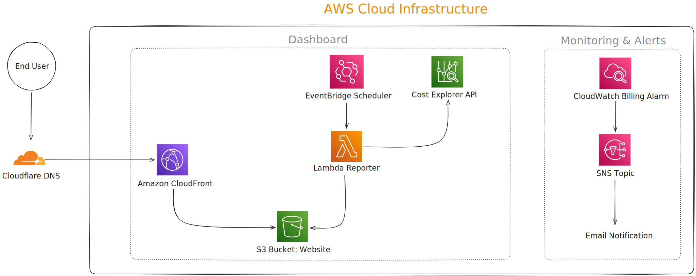

# AWS Cloud Cost Calculator

## The Business Problem: "The $30,000 Surprise"

For many small businesses and startups, moving to the cloud brings a hidden danger: billing complexity. With over 200 AWS services—each with its own pricing model (per hour, per GB, per request)—it is alarmingly easy for a team to provision resources expecting a $500 bill, only to receive a $5,000 invoice at the end of the month due to a forgotten instance or a misconfigured loop.

I built this project to solve a specific business pain point: **Opacity**. Business owners shouldn't need a cloud certification to know if they are burning cash.

## The Solution

**[🔗 View Live Dashboard](https://aws-monitor-cost.dariomazza.net)**

This system acts as a **translator**. It converts raw, technical AWS billing metrics into actionable business intelligence. Instead of forcing a user to navigate the complex AWS Billing Console, this solution provides:

1.  **Immediate Guardrails:** Automated alerts that trigger the moment spending crosses a safety threshold.
2.  **Executive Visibility:** A clean, accessible dashboard that strips away technical jargon.
3.  **Automated Auditing:** Weekly logic that checks for spending anomalies without human intervention.

## Architecture & Technical Implementation



I designed this architecture to be **Serverless** and **Event-Driven**, ensuring that the monitoring system itself costs almost nothing to run (leveraging the AWS Free Tier).

### 1. The Watchdog (CloudWatch & Alerts)
*   **Role:** Passive Monitoring.
*   **Function:** CloudWatch monitors `EstimatedCharges` in real-time.
*   **Business Value:** It eliminates the need for manual daily checks. The system is always watching.

### 2. The Alarm System (SNS)
*   **Role:** Immediate Response.
*   **Function:** If costs exceed defined thresholds (e.g., $50, 00), Amazon SNS triggers an immediate email/SMS to the administration team.
*   **Business Value:** Prevention. It turns a potential month-long money leak into a 5-minute fix.

### 3. The Analyst (AWS Lambda & EventBridge)
*   **Role:** Logic & Reporting.
*   **Function:** A Python script runs on a weekly schedule (via EventBridge). It queries the Cost Explorer API to aggregate data and compare trends.
*   **Business Value:** Automation. It performs the work of a financial analyst, automatically identifying which services are driving costs up.

### 4. The Dashboard (S3, CloudFront & OAI)
*   **Role:** Visualization.
*   **Function:** A static frontend hosted on S3 and delivered globally via CloudFront.
*   **Business Value:** Accessibility. It presents cost data in a simple UI that non-technical stakeholders can understand at a glance.

## Value Delivered (FinOps)

This project is a demonstration of **FinOps** principles—the intersection of finance and DevOps. It proves the ability to:

*   **Architect for Cost:** The monitoring infrastructure itself is designed to stay within the AWS Free Tier (using Lambda free usage tiers and S3 static hosting).
*   **Translate Technology to Business:** Bridging the gap between engineering activity and financial impact.
*   **Automate Governance:** Replacing manual spreadsheets and console logins with automated code-based guardrails.

---

## Technical Setup (How to Deploy)

While this is a portfolio demonstration, it is a fully functional tool.

**Prerequisites:**
*   AWS CLI & Terraform installed.
*   A domain name (for the CloudFront dashboard).

**Deployment:**
1.  **Clone & Init:**
    ```bash
    git clone https://github.com/your-username/aws-cloud-cost-monitor.git
    cd terraform && terraform init
    ```
2.  **Configure:** Update `variables.tf` with your alert email and thresholds.
3.  **Apply:**
    ```bash
    terraform apply
    ```